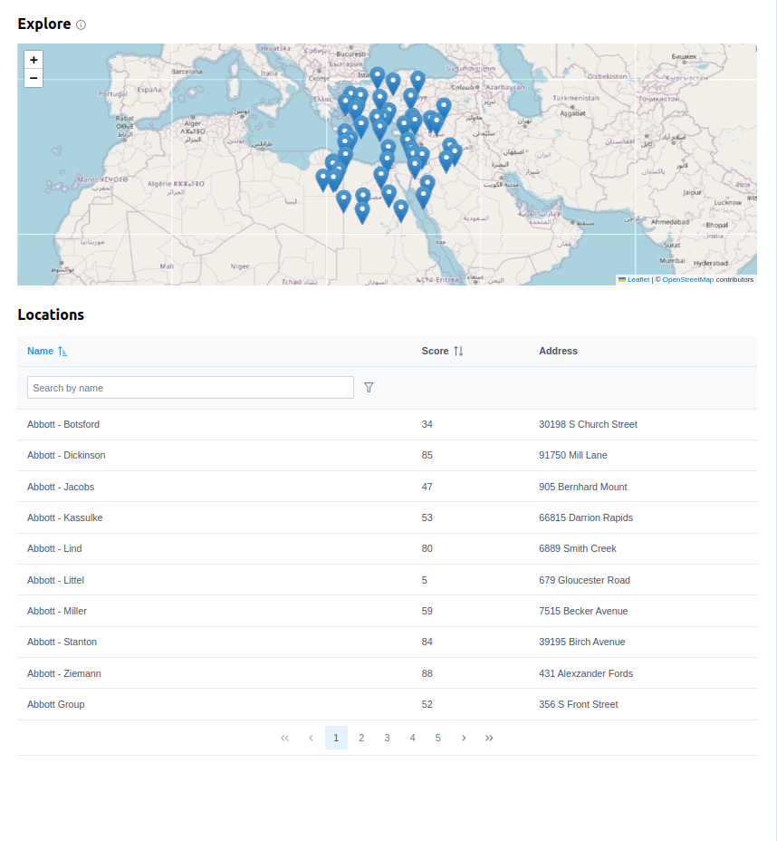

# Location Explorer App

## Overview

This application allows users to explore and find the nearest locations on a map. The main features include displaying locations on a map, listing all locations, and dynamically updating the map center based on user interactions.



## Features

- **Map Display**: The map displays the nearest locations based on the current center. When the map center changes, it fetches and displays the nearest locations to the new center.
- **Locations Listing**: All locations are listed in a table. Selecting a row in the table updates the map center to the selected location, which then fetches and displays the nearest locations.

## Issues and Fixes

### Mapbox Issue
- **Issue**: Initially, Mapbox was used for the map, but it is not a free package.
- **Fix**: Switched to using [Leaflet](https://leafletjs.com/), an open-source JavaScript library for interactive maps.

### DataTable Component
- **Component**: Used PrimeReact's `DataTable` component.
- **Features**: Utilized its search, filter, and sort utilities as they cover edge cases and are easy to use. Additionally, it supports debounced changes and dynamic loading.

## Caching

### Client-Side Caching
- **Tool**: `useQuery` from React Query.
- **Reason**: To improve performance by caching data fetched from the server, reducing the need for repeated network requests.

### Server-Side Caching
- **Tool**: `NodeCache`.
- **Reason**: To cache data on the server-side, improving response times for repeated requests and reducing load on the in-memory storage.

### Why Caching Matters
Due to the use of `faker` and in-memory storage, other caching services were not feasible. However, caching with `useQuery` and `NodeCache` improves performance by:
- Reducing the number of requests to fetch the same data multiple times.
- Ensuring faster response times for frequently accessed data.
- Potential improvements with other services: For large data sets, such as getting the nearest locations within a ~1000 km radius, using more robust caching solutions or databases (e.g., Redis, Memcached) would significantly enhance performance and scalability.

## Running the Application

To run the application, use Docker Compose to build and start the client and server services.

### Docker Compose

Make sure you have Docker and Docker Compose installed. Then, follow these steps:

1. Build and start the services:
   ```sh
   docker-compose up --build
   ```

2. Access the application:
- Client: http://localhost:3000
- Server: http://localhost:5555 


## Technical Details

### Map Integration

- **Library**: [Leaflet](https://leafletjs.com/)
- **Functionality**: 
  - Displays pins on the map for the nearest locations.
  - When the map center changes, it fetches and displays new locations.

### DataTable Integration

- **Library**: [PrimeReact](https://www.primefaces.org/primereact/)
- **Functionality**: 
  - Lists all locations with search, filter, and sort capabilities.
  - Selecting a row updates the map center to the selected location.

## Future Improvements

- **Scalability**: 
  - Implement more robust caching or database solutions for better performance with large data sets.
  
- **Additional Features**: 
  - Cover missing Error handling in client
  - Add more detailed information and functionalities to the map and the locations list.
  - Add unit tests for Serve and client
  - Change the theme/design

